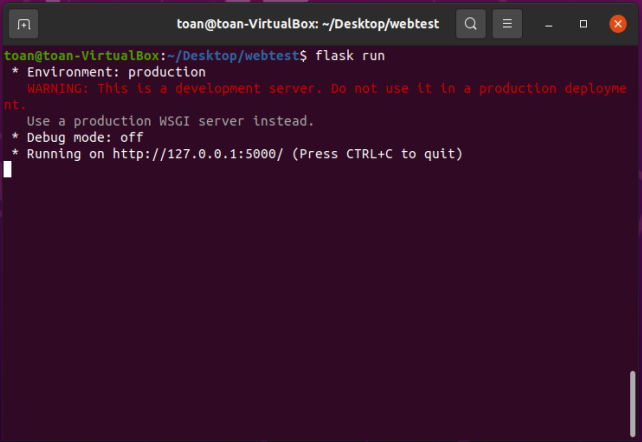
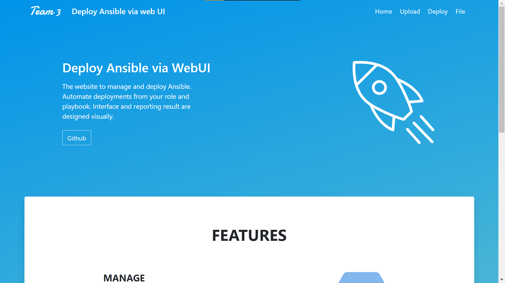
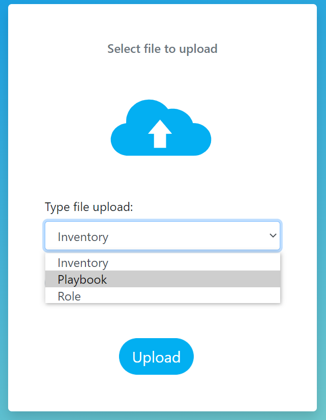
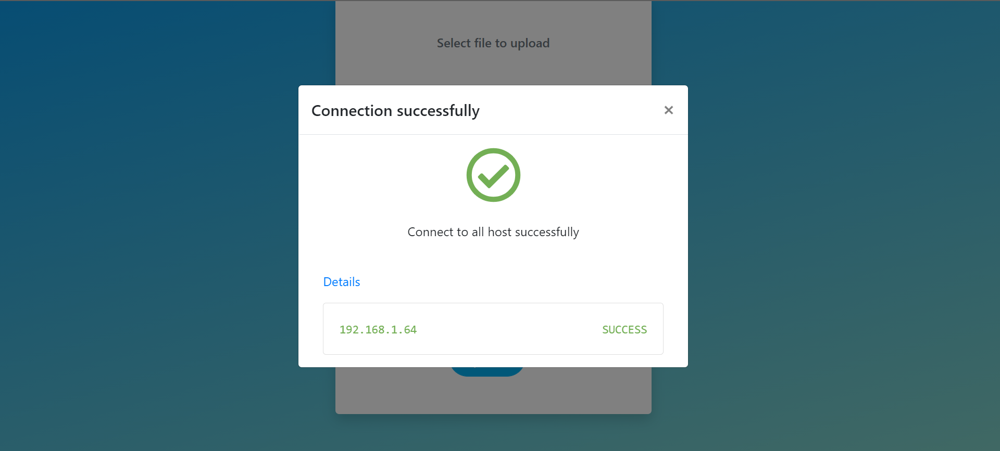
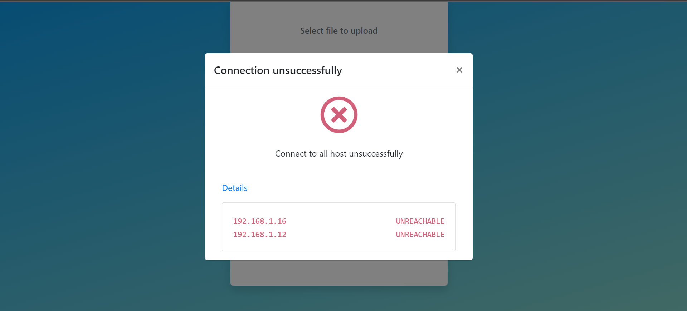
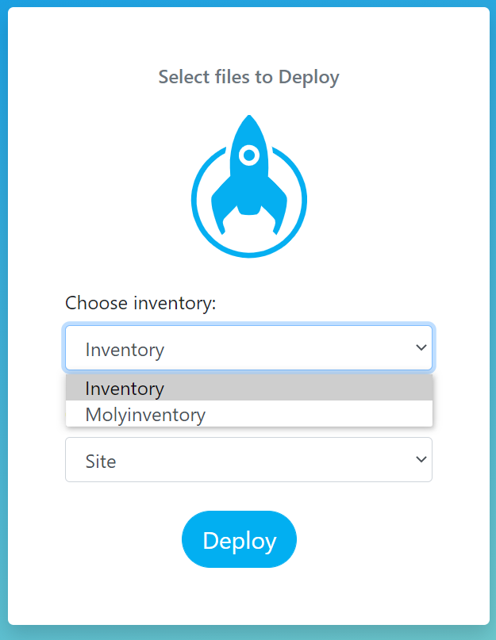
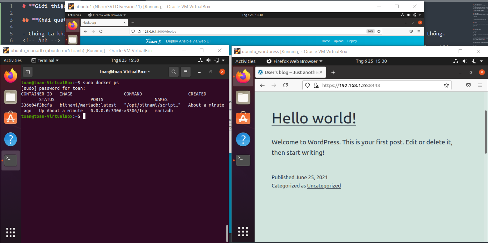
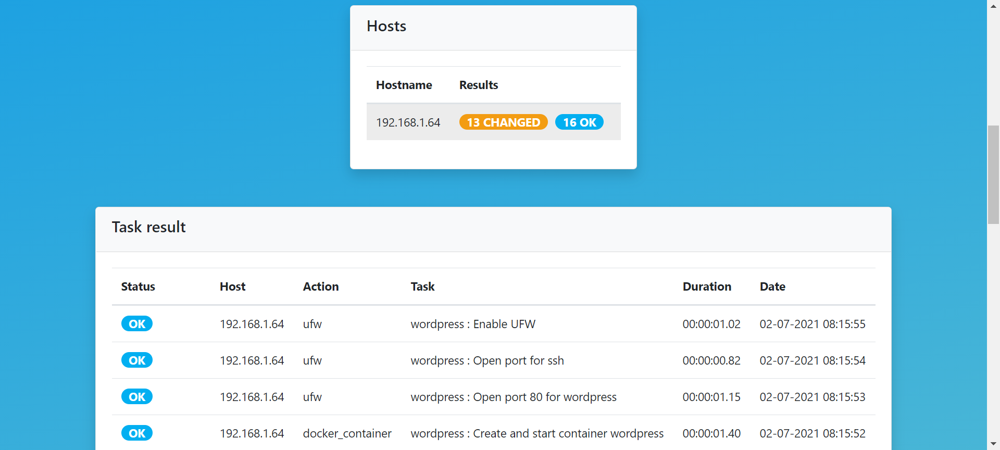
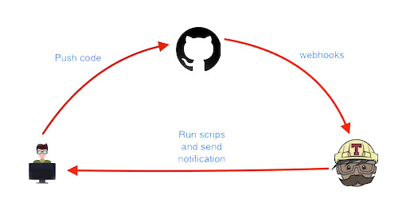
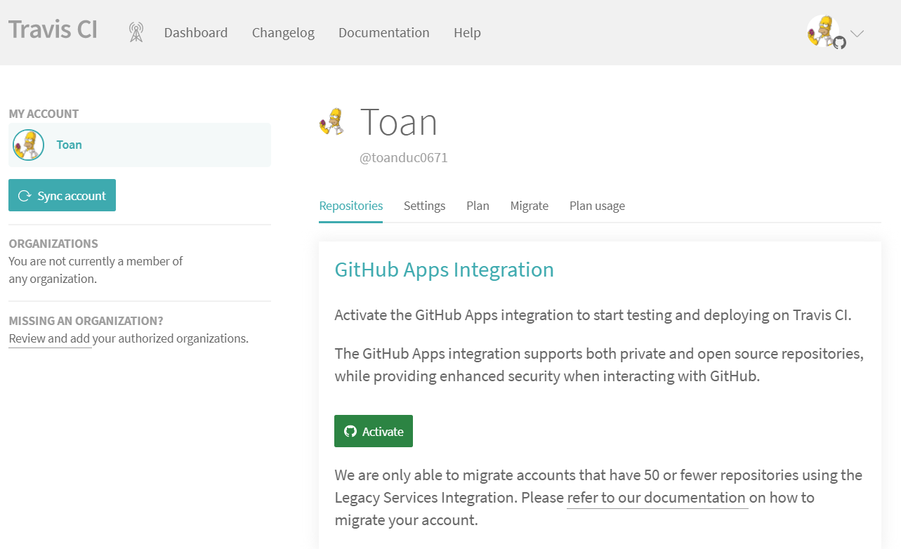

# Triển khai tự động hoá Ansible qua giao diện web

| Travis CI™ | GitHub® Actions | CircleCI® |
| ----------- | ----------- | ----------- |
| [](https://travis-ci.com/toanduc0671/Nhom3_VTDT) | [](https://github.com/toanduc0671/Nhom3_VTDT/actions/workflows/Git_CI.yml) | [](https://circleci.com/gh/toanduc0671/Nhom3_VTDT) |

- [Giới thiệu và hướng dẫn sử dụng sản phẩm triển khai tự động hoá Ansible qua giao diện web](#giới-thiệu-và-hướng-dẫn-sử-dụng-sản-phẩm-triển-khai-tự-động-hoá-ansible-qua-giao-diện-web)
  - [I. Khái quát về đề tài](#i-khái-quát-về-đề-tài)
  - [II. Hướng dẫn sử dụng](#ii-hướng-dẫn-sử-dụng)
    - [A. Cấu trúc](#a-cấu-trúc)
    - [B. Cài đặt ara-ansible và 1 số thư viện cần thiết](#b-cài-đặt-ara-ansible-và-1-số-thư-viện-cần-thiết)
    - [C. Run](#c-run)
    - [D. Giao diện web](#d-giao-diện-web)
      - [1. Homepage](#1-homepage)
      - [2. Upload](#2-upload)
      - [3. Deploy](#3-deploy)
  - [III.. Tích hợp Circle CI, Travis CI và GitHub Actions](#iii-tích-hợp-circle-ci-travis-ci-và-github-actions)
    - [A. Circle CI](#a-circle-ci)
      - [1. Overview Circle CI](#1-overview-circle-ci)
      - [2. Tích hợp vào project](#2-tích-hợp-vào-project)
    - [B. Travis CI](#b-travis-ci)
      - [1. Overview Travis CI](#1-overview-travis-ci)
      - [B. Tích hợp vào project](#b-tích-hợp-vào-project)
    - [C. GitHub Actions](#c-github-actions)
      - [1. Overview GitHub Actions](#1-overview-github-actions)
      - [2. Sử dụng GitHub Actions](#2-sử-dụng-github-actions)
      - [3. Giới thiệu sơ lược về pep8](#3-giới-thiệu-sơ-lược-về-pep8)

## I. Khái quát về đề tài

Chúng ta không còn xa lạ với công cụ tự động hoá ansible và tác dụng của nó đóng vai trò quan trọng thế nào trong quản trị hệ thống.


Đề tài trên của nhóm 3 đưa ra với mục tiêu giải quyết bài toán khó khăn về khoảng cách giữa người quản trị hệ thống với hệ thống, tối ưu thời gian trong việc triển khai khi có thể thực hiện qua giao diện web giúp người dùng có thể chọn file inventory cũng như các playbook và role để deploy hệ thống từ xa.

## II. Hướng dẫn sử dụng

### A. Cấu trúc

Dưới đây là sơ lược về cấu trúc của hệ thống.

```bash
.
├── app.py ------------------------------------ (code back-end)
├── static
│   ├── css
│   ├── imgs
│   ├── js
│   ├── svg
│   └── savefile ------------------------------ (vị trí lưu file người dùng upload)
└── templates --------------------------------- (front-end)
```

### B. Cài đặt ara-ansible và 1 số thư viện cần thiết

Để lưu lại lịch sử deploy của playbook chúng ta sử dụng một thư viện `Ara-Ansible`.
Trong repo này chúng ta thực hiện cài đặt và sử dụng `ara-ansible` không sử dụng API server

```bash
# Cài đặt Ansible và Ara
$ python3 -m pip install --user ansible "ara[server]"

# Cấu hình Ansible để sử dụng ARA callback plugin
$ export ANSIBLE_CALLBACK_PLUGINS="$(python3 -m ara.setup.callback_plugins)"
```

Ngoài ra bạn cần cài đặt thêm 1 số thư viện để chạy chương trình:

```bash
python3 pip install flask
python3 pip install pandas
```

### C. Run

Tại thư mục gốc chúng ta có thể run web với câu lệnh:

```bash
flask run
```



### D. Giao diện web

#### 1. Homepage



#### 2. Upload

Tại đây là nơi người dùng upload file để triển khai hệ thống bằng ansible, có 3 lựa chọn lần lượt là upload inventory, playbook và role.



Tương ứng, với dạng file là inventory thì hệ thống sẽ upload file đồng thời check connection với các managed node trong file inventory sau đó trả kết quả qua modals trên web.





Nếu dạng file là role thì người dùng sẽ upload file zip sau đó hệ thống sẽ tự động giải nén.

#### 3. Deploy


Tại đây người dùng chọn file inventory và playbook để tiến hành quá trình cài đặt hệ thống trên các managed node.



Sau khi nhấn **Deploy** và hệ thống sẽ bắt đầu quá trình cài đặt

Ta sẽ thực hiện demo với bài thực hành tuần 2 trong chương trình VTDT: deploy wordpress trên 2 máy ảo. Một VM cài đặt image mariadb một VM cài đặt wordpress.

Kết quả thu được:



Kéo xuống dưới ta sẽ thấy thông tin chi tiết về deploy được cập nhật theo thời gian thực.



## III.. Tích hợp Circle CI, Travis CI và GitHub Actions


### A. Circle CI

#### 1. Overview Circle CI

- CircleCI là một tool để thực hiện CI.
- Cách thực hiện khá đơn giản, quan sát trực quan trên giao diện web.
- Circle CI bản chất sử dụng Docker, trong file cấu hình ta sẽ chỉ định các`docker image` và các `job` . Trong các `job` sẽ có các `step`, trong các step cụ thể là các `command`.
- Quá trình chạy 1 job trên CircleCI:
    1. Khi dev push or merge vào một branch, circleCI sẽ tự biết event đó và khởi động job đc đặt tương ứng.
    2. Ban đầu Circle CI sẽ pull các image cần thiết vê và run trên môi trường cloud của nó.
    3. Sau đó chạy các `step` đã được cài đặt(thông thường step đầu tiên sẽ là checkout để lấy source code về).
    4. Các step tiếp theo chạy dựa trên file `config`.
    5. Sau khi chạy hết các step, các job. Nếu có lỗi thì mình sẽ nhận được thông báo `failed` tại `email`.

#### 2. Tích hợp vào project

1. Đăng nhập vào Circle CI
   - Bạn đăng kí tài khoản và đăng nhâp vào circleci (đăng nhâp dựa theo tài khoảng github/bitbucket)
   tại [https://circleci.com/signup/](https://circleci.com/signup/)

   - Trên giao diện này ta có thể browse các project trên tài khoản github của mình và team, setup Circle CI, theo dõi các job ,.. v.v

2. Setup circleCI cho project

   - Trên Web UI chọn Project tại thanh công cụ bên phải => chọn Setup project.

   

   - Circle CI sẽ hiển thị các gợi ý file config dựa trên project của bạn. Các bạn tạo file. `.Circleci/config.yml` tại local và push lên github.

   - Ví dụ về file `config.yml` sử dụng trong project này:

   ```yml
   version: 2.1
   orbs:
     python: circleci/python@1.2
   workflows:
     sample:  
       jobs:
         - Test
   jobs:
     Test:  
       docker:
         - image: cimg/python:3.8
       steps:
         - checkout
         - python/install-packages:
             pkg-manager: pip
         - run:
             name: Run tests
             command: pytest
   ```

   - Mọi người cần thêm các file test và list các package requirement trong project tại file `requirement.txt`.

   - Theo dõi trên CircleCI chúng ta sẽ theo dõi được quá trình thực hiện CI và debug được dễ dàng.
   => Kết quả:

   

   

### B. Travis CI

#### 1. Overview Travis CI


- Travis-ci là một nền tảng cung cấp dịch vụ continuous integration, được xây dựng đầy đủ các tính năng CI, giúp chúng ta dễ dàng test và deploy các dự án được lưu trữ trên GitHub hoặc bitbucket
- Mô hình hoạt động của Travis-ci:
  1. Developer sẽ push code lên github.
  2. Thông qua webhooks, Travis-ci sẽ biết được có code mới được commit, nó sẽ pull code đó về.
  3. Dựa vào file cấu hình .travis.yml travis sẽ tiến hành chạy và thông báo trở ngược lại cho người dùng.



#### B. Tích hợp vào project

1. Đăng nhập vào travis-ci.com, travis sẽ yêu cầu đồng bộ với github.
2. Nhấn vào Activate tại mục Repositories để cấp quyền truy cập vào tất cả repo hoặc repo nhất định trên github.
  

3. Tạo file .travis.yml

  ```yml
  language: python
  python:
    - "3.6.7"
  install:
    - pip install -r requirements.txt
  # command to run tests
  script:
    - pytest
  ```

- Ở đây nhiệm vụ của `.travis.yml` cũng tương tự với `config.yml` ở phần Circle CI bên trên là cài đặt dependencies trong `requirement.txt` và chạy `pytest`.

- Commit và push file .travis.yml lên thư mục gốc của repository và truy cập vào [https://travis-ci.com/github/#username/#repoName](https://travis-ci.com) để xem kết quả.


### C. GitHub Actions

#### 1. Overview GitHub Actions


1. Github Actions cho phép chúng ta tạo `workflows` cho dự án trực tiếp trên Github repository của chúng ta.
2. Github Actions giúp tự động hóa quy trình phát triển phần mềm kết hợp với pull request và issues. Chúng ta có thể viết các tác vụ riêng lẻ, được gọi là các actions và kết hợp các actions đó lại với nhau để tạo ra một workflow theo ý muốn. Workflow là các tiến trình tự động cần có để thiết lập trong repository của mình để build, test, publish package, release, hoặc deploy dự án nào đó trên Github.
3. Với Github Actions chúng ta có thể tích hợp continuous integration (CI) và continuous deployment (CD) trực tiếp trên repository của mình.

#### 2. Sử dụng GitHub Actions

1. Cách sử dụng github actions rất đơn giản, chúng ta có thể tạo ra workflows theo cấu trúc file `.github/workflows/#tenfile.yml`.
2. ở repository này nhóm tạo file `Git_CI.yml` và tích hợp test `pep8` cho code của project.

```yml
name: autopep8
on: push
jobs:
  autopep8:
    runs-on: ubuntu-latest
    steps:
      - uses: actions/checkout@v2
      - name: autopep8
        uses: peter-evans/autopep8@v1
        with:
          args: --recursive --in-place --aggressive --aggressive .
      - name: Create Pull Request
        uses: peter-evans/create-pull-request@v3
        with:
          commit-message: autopep8 action fixes
          title: Fixes by autopep8 action
          body: This is an auto-generated PR with fixes by autopep8.
          labels: autopep8, automated pr
          reviewers: peter-evans
          branch: autopep8-patches

```

- Xem kết quả test tại tab Actions trên repository.


#### 3. Giới thiệu sơ lược về pep8

- Python Enhancement Proposal #8 (thường được viết tắt PEP-8), là tập hợp các chỉ dẫn về định dạng code, phong cách lập trình được chia sẻ chung giữa các lập trình viên Python. PEP-8 được đề xuất bởi các chuyên gia trong "hội đồng" sáng lập ngôn ngữ lập trình Python. Việc viết code theo đúng chuẩn chung PEP-8 sẽ giúp cho các lập trình viên dễ dàng hơn khi đọc code của nhau.

